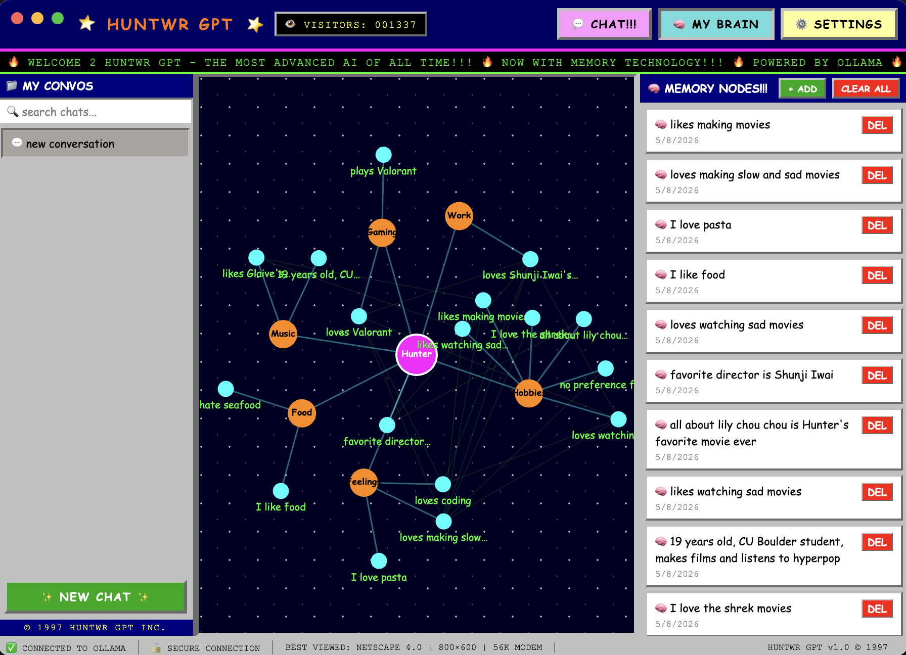
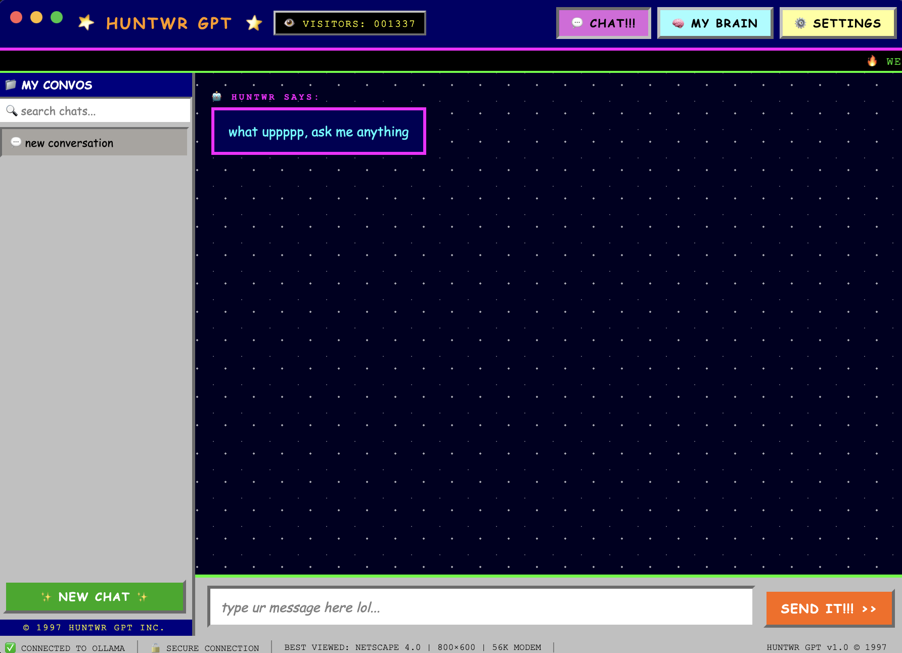

# HuntwrGPT

A locally-run AI desktop app that talks like me. Built with Electron and powered by [Ollama](https://ollama.com) running Llama 3 — fully offline, no API keys, no data leaving your machine.

It ships as a normal desktop app: on first launch it detects, installs, and starts Ollama automatically, pulls the model, then opens straight into a chat UI with a persistent memory system and a live, force-directed memory graph.

<p align="center">
  
  <br>
  <sub>The memory graph — every fact the model has picked up, clustered into category hubs, draggable and pannable in real time</sub>
</p>

<p align="center">
  
  <br>
  <sub>The chat interface</sub>
</p>

## Features

- **Local-first** — runs entirely on-device via Ollama, no cloud calls, no accounts
- **Zero-setup onboarding** — checks for Ollama on launch, silently downloads/installs it and pulls the model if missing
- **Custom persona** — a detailed system prompt shapes tone, vocabulary, and personality rather than sounding like a generic assistant
- **Automatic memory extraction** — the model tags facts it learns about you mid-conversation (`[REMEMBER: ...]`), which get parsed out, deduplicated (Jaccard similarity on normalized word sets), and saved
- **Interactive memory graph** — memories render as a force-directed graph on `<canvas>`, grouped into category hubs (gaming, work, people, goals, etc.) with pan/zoom/drag, click-to-inspect popups, and an adaptive render loop that idles at 0% CPU once the graph settles
- **Manual memory editing** — add or delete memories directly from the graph panel
- **Multi-conversation chat** — threaded conversations with search, markdown rendering, and retry-on-error

## Tech stack

| Layer | Choice |
|---|---|
| App shell | Electron |
| Model runtime | Ollama (Llama 3), local HTTP API |
| UI | Vanilla JS / HTML / CSS — no framework, no build step |
| Memory graph | Canvas API, custom force-directed layout |
| Packaging | electron-builder (`.dmg` / `.exe`) |
| Persistence | Flat JSON files in `~/.huntwrgpt/` |

## Getting started

```bash
git clone https://github.com/Huntwr/HuntwrGPT.git
cd HuntwrGPT
npm install
npm start
```

On first launch the app checks for Ollama, installs it if it isn't present, and pulls the `llama3` model (~4GB, one-time). No API keys or accounts needed — everything runs locally.

### Build a distributable

```bash
npm run build
```

Outputs to `dist/`:
- macOS: `HuntwrGPT-1.0.0-arm64.dmg`
- Windows: `HuntwrGPT Setup 1.0.0.exe`

## How it works

- **`main.js`** — Electron main process. Detects/installs/starts Ollama, pulls the model, streams setup progress to the loading screen, and hands off to the chat window.
- **`index.html`** — the entire UI: chat, settings, and memory graph, all in one file with no framework.
- **`loading.html`** — startup screen shown while Ollama is being checked or installed.

User data (conversations, extracted memories, settings) is stored outside the repo in `~/.huntwrgpt/` and never touches the project directory.

### Why inline memory tags instead of a separate extraction pass

Memory could be extracted by making a second, dedicated call after every turn — a focused prompt whose only job is "here's the message, return any facts as JSON." That's the more reliable design: a purpose-built prompt is easier to control and less likely to drift or hallucinate than instructions bolted onto a conversational one.

I went with inline `[REMEMBER: ...]` tags instead, appended to the same completion that generates the reply. The reason is that this app runs a small model entirely on-device, so every extra round trip is a real, felt cost — there's no fast cloud inference to hide a second call behind. Folding extraction into the existing generation means memory capture is effectively free: one token stream, one request, no added latency, no extra failure mode to handle if the second call times out or the connection drops mid-conversation.

The tradeoff is reliability: the model has to remember to append tags correctly on every single turn without a dedicated verification step, so the parsing side has to compensate. `extractMemory()` uses `matchAll` (not `match`) to catch multiple tags per response, filters out placeholder text the model sometimes echoes from its own instructions (`"something about"`, `"e.g."`), and dedup uses Jaccard similarity on normalized word sets rather than exact string matching, since the same fact tends to get re-tagged with slightly different phrasing across turns. It's a bet that latency and simplicity matter more than extraction precision for a single-user local app — and that the failure mode (an occasional missed or duplicate memory) is cheap, recoverable, and already covered by manual add/delete in the UI.

## License

MIT — see [LICENSE](LICENSE).
